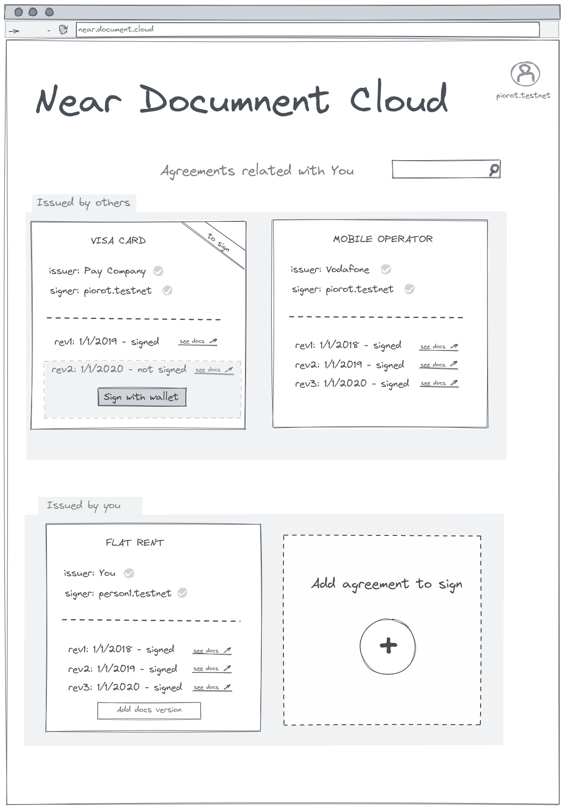
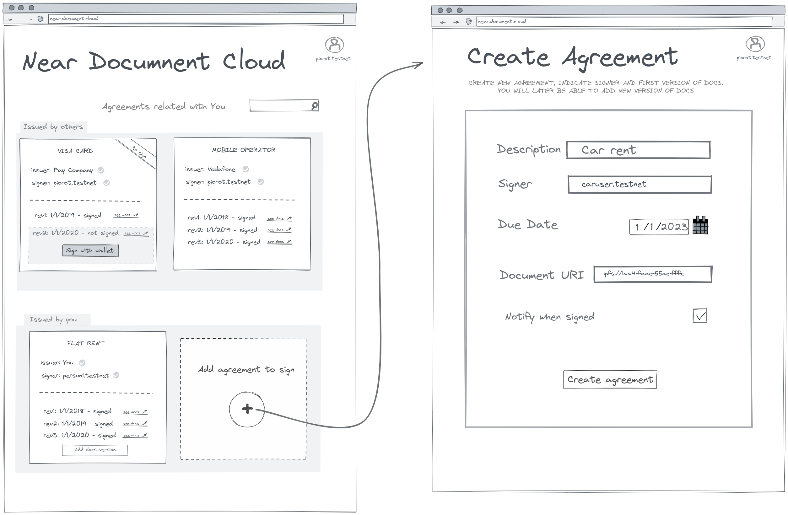
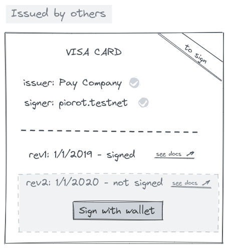
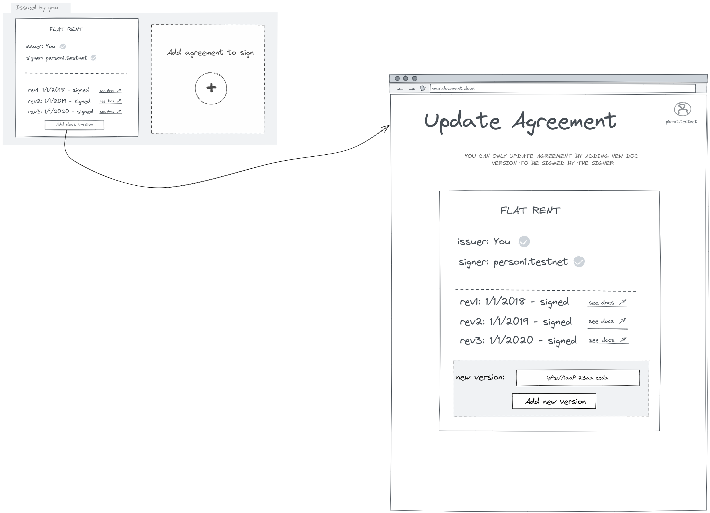

# NEAR Document Cloud
**Robust and trustless solution to use NEAR blockchain for managing and signing documents**

*project created form template `near-sdk-as` Starter Kit*

## Problem Description
Everyday we sign agreements with various companies like financial institutions, mobile operators and other individuals like real-estate agents and landlords. Similarily comapnies need to have thousands of various agreements, policies and docs signed by consumers, contractors, business partners.

In many cases storing and tracking those documents is cumbersome. Not to mention several documents versions for a single topic like for instance fluctating bank fees that each of us need to sign on regular basis.

For this reason individuals & companies seek solution to manage their agreements with various parties in easy, managable and **trustless** way.

## Solution Description

### Solution Requirements:
* List all agreements user has signed and has issued to be signed by someone else.  
* Allow to add revisions (documents versions)
* Allow to sign documents
* Documents should be stored in ipfs; link should be stored on-chain

### Solution UI concept

*Since I believe image is best explainer I added those wireframes to make the reader get the whole idea quiclky. The UI layer is not implemented, however the smart-contract itself has already most of needed code. So to have it fully working one will only need to add some (view) filtering capabilities and do the UI layer*

### Listing all agreements

Project should potentially allow to show all agreements (especially all agreements related to logged user). There should be clear distinction for:
* `Issued by others` - agreements the user is supposed to sign or has already signed (top row)
* `Issued by You` - agreements user has issued and expects someone to sign (bottom row)

### Ading new agreement 
Any user can add an agreement. Adding agreement requires to input at least ipfs link to initial document version and intended signer. All remaining details are a matter of potential extension and decision where to store these (on-chain vs off-chain).

Agreements are immutable with exception to adding new agreement revision and signing it

### Signing agreement

User can sign agreement only if it has been issued with explicit indication he/she is intended signer. Trying to sign agreement that has not been issued for acting user will throw (reject tx).

In the image above we can see Agreement with credit cart operator is `not signed` because it has been updated - issuer has added `revision two` and to formaly be in force this agreement needs to be signed again. This can be easily achieved by clicking sign with wallet button and acknowledging the tx.

### Adding new revision

User can only add revision for those agreements he/she has issued. Trying to add revision to agreement issued by someone else will result in transaction rejection.

Adding new revision could potentially be achieved on separate screen and require just entering `ipfs link` to new document. All other details of agreement like previous links, signing history, or other details should be read only at this stage.

Adding new revision sets the whole agreement in `isSigned : false` state, no matter if it has been already signed or not. Conditions have changed and the agreement can not be automatically in force/signed without signer explicitly signing it again.

## Usage

### Unit tests

Whole business logic of Agreement has been covered with unit tests. Run unit tests by: `yarn test`
### Getting started

(see below for video recordings of each of the following steps)

INSTALL `NEAR CLI` first like this: `npm i -g near-cli`

1. clone this repo to a local folder
2. run `yarn`
3. run `yarn build`
4. run `./scripts/1.dev-deploy.sh`
5. run `./scripts/2.use-contract.sh`
6. run `./scripts/2.use-contract.sh` (yes, run it to see changes)
7. run `./scripts/3.cleanup.sh`

### Videos

https://www.loom.com/share/b2c007bbf766468bb6d8cdaa402ffadf

